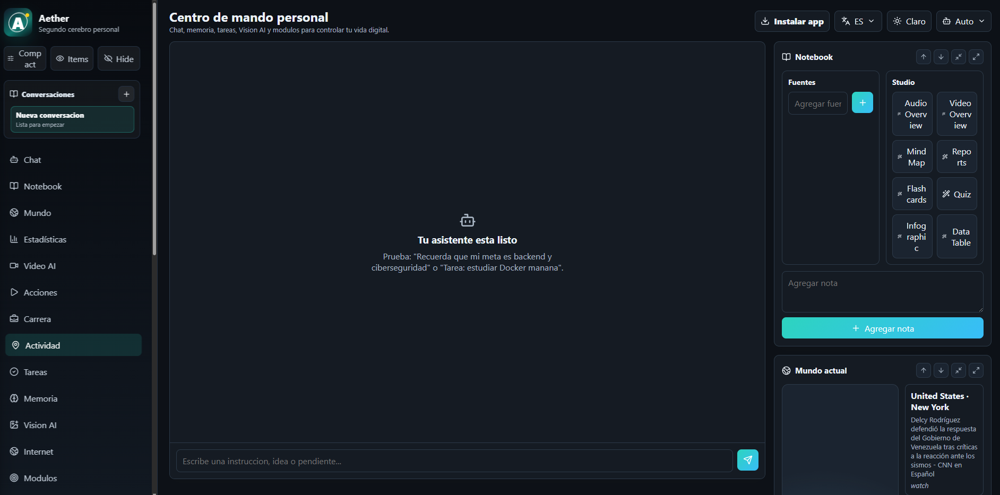
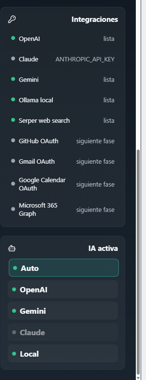

# Aether

**Personal AI Second Brain - OS with memory, tasks, web search, vision AI and multi-provider support.**

Aether is a full-stack personal AI workspace designed to help you organize your life, learn faster, manage goals, track career progress, analyze information, and save time with AI-assisted workflows.

It is not just a chatbot. The goal is to build a private command center with long-term memory, conversations, tasks, web search, visual analysis, offline support, world intelligence, career tracking, and optional integrations with AI providers and productivity tools.

## Live Demo

[Open Aether / Sentinel AI OS](https://sentinel-store-frontend.vercel.app/)



## Screenshots

### AI workspace dashboard


### Navigation and workspace modules


### AI provider integrations



### Notes, memory and workflows


## Highlights

- AI chat with persistent conversation history.
- Conversation sidebar with create, switch and delete actions.
- Multi-provider AI selector: `Auto`, `OpenAI`, `Gemini`, `Claude`, `Ollama`, or `Local`.
- Web search with Serper support and fallback search.
- Compact source references for web-grounded answers.
- Personal memory system.
- Task manager and action center.
- Notebook-style workspace with sources, notes and studio outputs.
- Vision AI for images, screenshots, visual errors and OCR-ready workflows.
- Voice input for the chat using the browser speech recognition API.
- Local face presence check for profile/security experiments without storing biometric identity.
- Video AI using Gemini for video uploads or YouTube URLs.
- Career dashboard for job applications, recruiters, salary expectations and reminders.
- Offline-first PWA support with Workbox and IndexedDB/Dexie.
- World Pulse with country news, currencies, Colombian peso, gold, Bitcoin and GDP ranking.
- Activity tracker foundation for location, app usage and notifications.
- Light and dark themes.
- Language selector: Spanish, English, Portuguese and French.
- Responsive layout optimized for desktop and Android PWA usage.

## Tech Stack

- **Frontend:** React, TypeScript, Vite
- **Backend:** Node.js, Express, TypeScript
- **Storage:** JSON for local development, PostgreSQL migration included
- **Offline:** Workbox, IndexedDB, Dexie.js
- **Realtime:** WebSockets
- **AI Providers:** OpenAI, Google Gemini, Anthropic Claude, Ollama
- **Search:** Serper API with fallback search
- **Deployment:** Railway-ready

## Quick Start

### Windows

Double-click:

```text
run-aether.bat
```

The script will:

- Check Node.js and npm.
- Create `backend/.env` from `.env.example` if needed.
- Install dependencies.
- Start backend and frontend.
- Open `http://localhost:5173`.

To stop the app, go back to the terminal window and press `Ctrl+C`.

### Manual Run

```bash
npm install
npm run dev
```

Local services:

- Frontend: `http://localhost:5173`
- Backend: `http://localhost:4100`

## Android PWA

To use Aether on Android:

1. Start the app locally or deploy it.
2. Open the frontend URL in Chrome.
3. Tap **Add to Home screen** or use the in-app install button.
4. Launch Aether like a mobile app.

For local mobile testing from your phone, use your computer LAN IP instead of `localhost`.

Example:

```text
http://192.168.1.20:5173
```

## Environment Variables

Copy `.env.example` to `backend/.env`:

```bash
cp .env.example backend/.env
```

PowerShell:

```powershell
Copy-Item .env.example backend/.env
```

Main variables:

```env
PORT=4100
DATA_FILE=./data/aether-store.json

OPENAI_API_KEY=
OPENAI_MODEL=gpt-4.1-mini

ANTHROPIC_API_KEY=
ANTHROPIC_MODEL=claude-3-5-sonnet-latest

GEMINI_API_KEY=
GEMINI_MODEL=gemini-1.5-flash
GEMINI_VIDEO_MODEL=gemini-1.5-pro

OLLAMA_BASE_URL=http://localhost:11434
OLLAMA_MODEL=llama3.1

SERPER_API_KEY=

GMAIL_USER=
GMAIL_APP_PASSWORD=
APP_BASE_URL=http://localhost:5173
```

## Connecting AI Providers

Aether works in local mode without external keys, but stronger answers require provider API keys.

Provider behavior:

- **Auto:** chooses the best configured provider.
- **OpenAI:** requires `OPENAI_API_KEY`.
- **Gemini:** requires `GEMINI_API_KEY`.
- **Claude:** requires `ANTHROPIC_API_KEY`.
- **Ollama:** requires Ollama running locally.
- **Local:** no external AI cost, but less capable.
- **Serper:** not an AI model; it powers web search and current references.

Railway variables example:

```env
OPENAI_API_KEY=sk-...
OPENAI_MODEL=gpt-4.1-mini

GEMINI_API_KEY=...
GEMINI_MODEL=gemini-1.5-flash
GEMINI_VIDEO_MODEL=gemini-1.5-pro

SERPER_API_KEY=...
```

Do not commit real API keys to GitHub.

### Connection Checklist

| Connection | Variable | Used for | Status in app |
| --- | --- | --- | --- |
| OpenAI | `OPENAI_API_KEY` | Strong chat reasoning and multimodal responses | Integrations panel |
| Gemini | `GEMINI_API_KEY` | Chat, Vision AI and Video AI | Integrations panel |
| Claude | `ANTHROPIC_API_KEY` | Optional alternate reasoning model | Integrations panel |
| Serper | `SERPER_API_KEY` | Better web search and current references | Integrations panel |
| Ollama | `OLLAMA_BASE_URL` | Local models on your own machine | Integrations panel |
| Gmail SMTP | `GMAIL_USER`, `GMAIL_APP_PASSWORD` | Email verification codes | Login modal |

You can verify the backend is alive at:

```text
GET /health
GET /api/integrations
GET /api/auth/me
```

## Email Login

Aether includes a free guest mode and an email-code login foundation.

For local testing, if Gmail is not configured, the backend returns a dev code and logs it in the console. For real email delivery through Gmail, create a Google App Password and set:

```env
GMAIL_USER=your_email@gmail.com
GMAIL_APP_PASSWORD=your_google_app_password
APP_BASE_URL=https://your-aether-url.com
```

The login flow sends a 6-digit verification code and creates a 30-day session.

## Main Modules

### Chat Assistant

Ask questions, create tasks, store memories, use web search and continue separate conversations.

Examples:

```text
Remember that my goal is backend and cybersecurity.
Task: study Docker tomorrow.
What should I study today?
Create a chart with my focus hours: Monday 2, Tuesday 3.
```

The chat composer includes a microphone button. On supported browsers, especially Chrome, Aether can transcribe your voice into the input box before sending.

### Notebook

Collect sources, write notes and generate study outputs such as:

- Audio overview
- Video overview
- Mind map
- Reports
- Flashcards
- Quiz
- Infographic
- Data table

### World Pulse

Track what is happening globally:

- News by country and city.
- Interactive globe.
- Currency rates.
- Colombian peso.
- Gold in USD and COP.
- Bitcoin in USD and COP.
- GDP ranking and growth probability.

### Vision AI

Analyze:

- Photos
- Screenshots
- UI errors
- Docker/terminal errors
- Dashboards
- Diagrams
- Documents and visual notes

### Local Face Presence Check

Aether includes a privacy-safe camera check inside the profile modal. It can open the device camera and, when the browser supports `FaceDetector`, confirm whether a face is visible.

Important boundaries:

- It does **not** identify who the person is.
- It does **not** compare faces.
- It does **not** store face embeddings or biometric templates.
- It runs locally in the browser and stops the camera after the check.

This is a safe foundation for presence/liveness UX experiments, not biometric authentication.

### Video AI

Upload a video or paste a YouTube URL and ask questions about it using Gemini.

### Career Dashboard

Track job applications:

- Company
- Role
- Date
- URL
- Status
- Notes
- Recruiter name and email
- Salary expectation
- Next action reminder

AI prompts include:

```text
Prepare me for my interview with [company].
Write a cover letter for [role].
What questions will they ask at [company]?
```

### Action Center

Ask Aether to prepare actions such as:

```text
Schedule a meeting tomorrow at 3 PM.
Draft a message to Carlos saying I will arrive at 3 PM.
Prepare an email for the recruiter.
Remind me to study Docker tomorrow.
```

For safety, Aether prepares actions for approval first. Sending emails, messages or calendar events requires future OAuth integrations.

### Offline/PWA

Aether includes:

- Service worker with Workbox.
- Static asset caching.
- API response caching.
- IndexedDB local storage.
- Offline chat/task/career cache foundation.
- Sync strategy for offline career entries.

Strategy:

```text
Online  -> backend + IndexedDB
Offline -> IndexedDB
Back online -> sync queued changes
```

## PostgreSQL

The MVP can run with JSON storage, but PostgreSQL migration support is included.

1. Create a PostgreSQL database.
2. Set `DATABASE_URL` in `backend/.env`.
3. Run:

```bash
psql "$DATABASE_URL" -f backend/migrations/001_initial_postgres.sql
```

4. Migrate existing JSON data:

```bash
npm run db:migrate-json --workspace backend
```

## Build

```bash
npm run build
```

Build individual workspaces:

```bash
npm run build --workspace frontend
npm run build --workspace backend
```

## Deployment Notes

For Railway:

- Deploy the backend service.
- Add backend environment variables in Railway.
- Generate a public backend domain.
- Deploy the frontend with `VITE_API_URL` pointing to the backend URL.

Example frontend variable:

```env
VITE_API_URL=https://your-backend.up.railway.app
```

## Current Limitations

- Gmail, Calendar, Microsoft 365, WhatsApp and Telegram actions are planned integrations and require official APIs/OAuth.
- Automatic Android app usage tracking requires a native Android/React Native app with Usage Access permissions.
- Location tracking requires explicit user permission.
- Claude API usage is billed separately from Claude web/app subscriptions.
- Some providers may require billing to be enabled before API keys work.

## Roadmap

- Full PostgreSQL persistence.
- OAuth integrations for Gmail, Calendar, GitHub and Microsoft 365.
- Native Android companion app.
- Real notification scheduling.
- Advanced charts generated from natural language.
- Better document ingestion for PDF, Word, Excel and PowerPoint.
- Agent browser automation with permission checkpoints.
- Long-term semantic memory and retrieval.

## License

MIT
